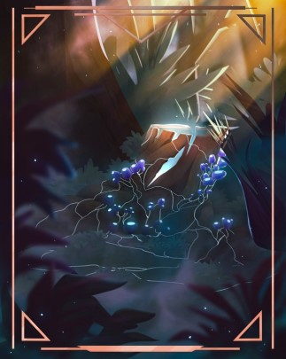
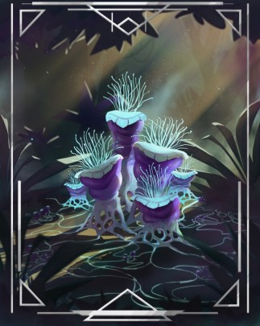
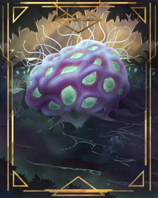

# Hyphid Colony Stages
The ultimate goal of any Hyphid colony is to learn and grow by accumulating experiences through Boids. The colony passes through four major phases over time With enough time and resources a hyphid colony can grow to encompass an entire planet and more. 

1) Recently established, young and vulnerable, hyphid colony needs to attract any organisms to establish genesis Boid psyche. The Genesis psyche of the colony will determine major traits of the colony for its entire lifetime. A hyphid colony that started life with insect Boids will be very different from one that started with reptile or bird Boids. The collective consciousness of the hyphid colony is like a young child. The colony can’t directly communicate with the Boids but instead relies on instincts.

[Mint your own NFTs!](https://nft.boid.com)  |  [Look at the template!](https://telos.neftyblocks.com/templates/nft.boid/242) 

2) The Hyphid colony is now established, stable and growing steadily with some initial child colonies forming. Boids have been established in a variety of different organisms and the colony has collected a moderate amount of experiences that informs future growth. The Boids have developed tools and architecture that facilitates future growth. The colony can communicate using pheromones.

[Mint your own NFTs!](https://nft.boid.com)  |  [Look at the template!](https://telos.neftyblocks.com/templates/nft.boid/240) 

3) The colony continues to grow and has established successful child colonies on the same planet that are thriving. A high variety of Boid organisms gives the colony good resilience and the Boids have developed advanced tools and technology based on the collective experiences of previous generations. The colony communicates using electrochemical signals and combined with Boid technology, has “eyes, ears, mouth” that enables it to directly manage the society.
  

[Mint your own NFTs!](https://nft.boid.com)  |  [Look at the template!](https://telos.neftyblocks.com/templates/nft.boid/241) 
  
4) Called the Gaia Boid stage, the colony has spread to cover the majority of the planet and has hosts for thousands of generations in nearly every form of life on the planet. The collective consciousness of the colony far exceeds the intelligence level of any other living organism. The colony can communicate telepathically, including with other Gaia Boid planets. Little is known about Gaia Boids but rumors have claimed they are able to manipulate space and time and coordinate with other Gaia planets on the other side of the universe.

___
**by "John H."**