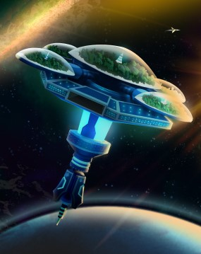

# The Exodus

[Mint your own NFTs!](https://nft.boid.com)  |  [Look at the template!](https://telos.neftyblocks.com/templates/nft.boid/251) 

The Boid colonies collectively developed a massive generational ship (The Ark) which would serve as their new home as they travel space exploring new planets. The Boid colonies have permanent places on the Ark, which they use as a base to launch expeditions and adventures. The ship has no specific destination and travels endlessly so Boids can rely on the ark for comfortable long-term space travel as they explore the universe.
___
**by "John H."**